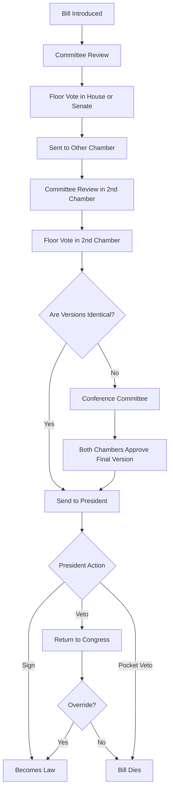

# my-resources

Resources from CM515 class

## R resources

<https://www.markdownguide.org/cheat-sheet/>

## Python

<https://docs.python.org/3/library/stdtypes.html#>

## Image analysis

## Stats

<https://sites.google.com/view/csu-stats-teaching-apps>

## Data managment

<https://dmptool.org/>

## Bioinformatics

### Gemome Browser

<https://hgdownload.soe.ucsc.edu/downloads>




<pre lang="markdown"><code>```mermaid graph TD A[Legislative Branch<br/>(Congress)] -->|Impeaches President<br/>Overrides veto<br/>Confirms appointments| B[Executive Branch<br/>(President)] B -->|Vetoes laws<br/>Calls special sessions<br/>Executes laws| A A -->|Creates lower courts<br/>Confirms judges<br/>Can impeach judges| C[Judicial Branch<br/>(Courts)] C -->|Declares laws unconstitutional| A B -->|Appoints judges<br/>Grants pardons| C C -->|Declares executive actions unconstitutional| B ```</code></pre>
